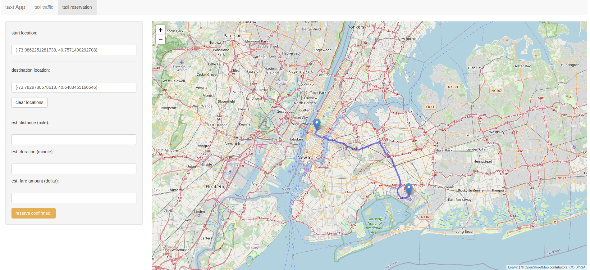
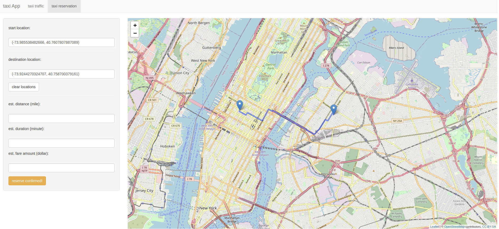

# NYC taxi data visualization and services using Shiny

## check out this app live on Shiny host: https://simonsong-first-shiny.shinyapps.io/NYC_taxi_service/

### background
This is a project for my visualization course
    - It uses NYC taxi data for 8/2013
    - It combined with the daily weather and borough (nta) information to the original data
    - It uses R shiny as the main tools
    - Packages required in this App:
        * library(shiny)
        * library(leaflet) for map visualization
        * library(leaflet.extras) for traffic heatmap
        * library(osrm) for shortest path finding and calculations
        * library(shinyjs) for disable and enable shiny widgets
        * library(tidyverse) for basic data processing
        * library(nycgeo) for NYC borough and NTA data
        * library(sf) for manipulate GIS data
        * library(geosphere) for Haversine distance calculation

### functionalities support 
* Taxi traffic visualization
    1. Taxi traffic heatmap visualization (total and 24-hour in a sliding bar)
    
        - the sliderbar -1 means total traffic,
        - sliderbar 0-23 means 24 hours starting from midnight to 11pm
    2. Taxi traffic with borough and NTA visualization 
    
        - The two red NTAs are two airports
        - Manhattan has heavy taxi traffic too 
    3. Taxi traffic with drive speed visualization
    
        - Speed averaged by NTA region
        - The more red, the slower speed
        - most region in NYC has heavy traffic in average
* Taxi reservation info
    1. add and drop pin on NYC maps
    
        - support random drop marker on the map
    2. Calculate shortest distance between two markers on NYC map
    
        - show shortest routes between two markers
    3. Recommend real cost, distance, and drive duration using taxi data along with ideal(free traffic) distance and duration.
    
        - show real and ideal route distance between two markers from taxi data and "osrm" package, respectively 
        - show real and ideal drive duration between two markers from taxi data and "osrm" package, respectively
        - show estimated cost from taxi data

### Happy exploring! Star if you like it!